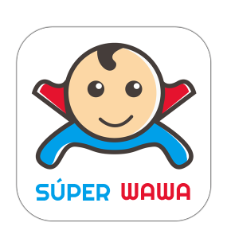
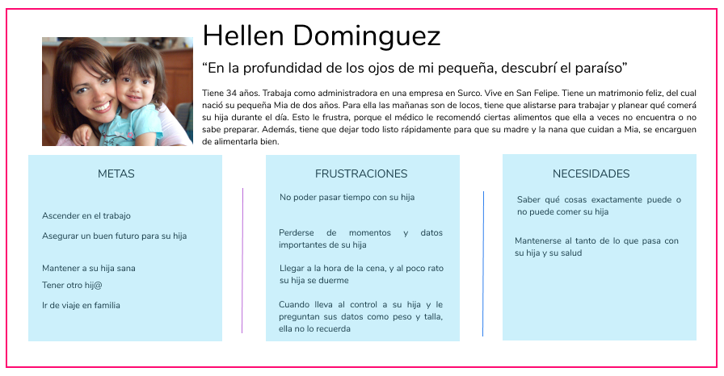
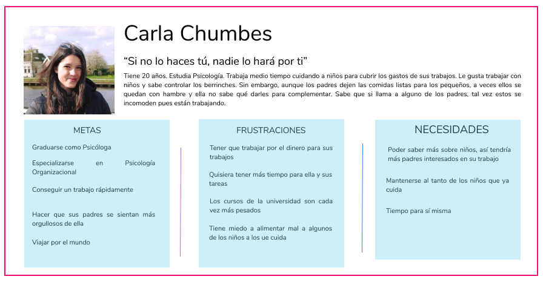
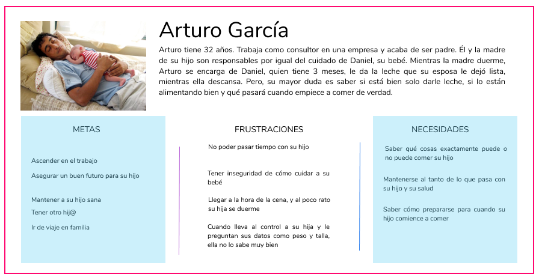
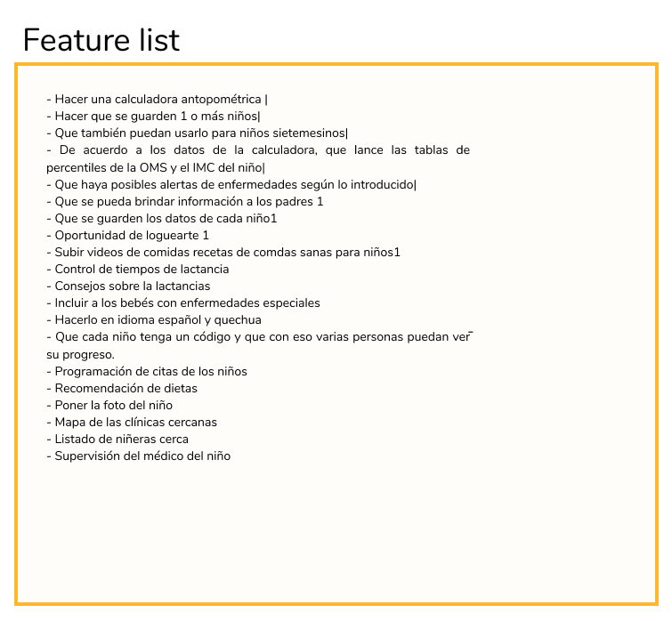
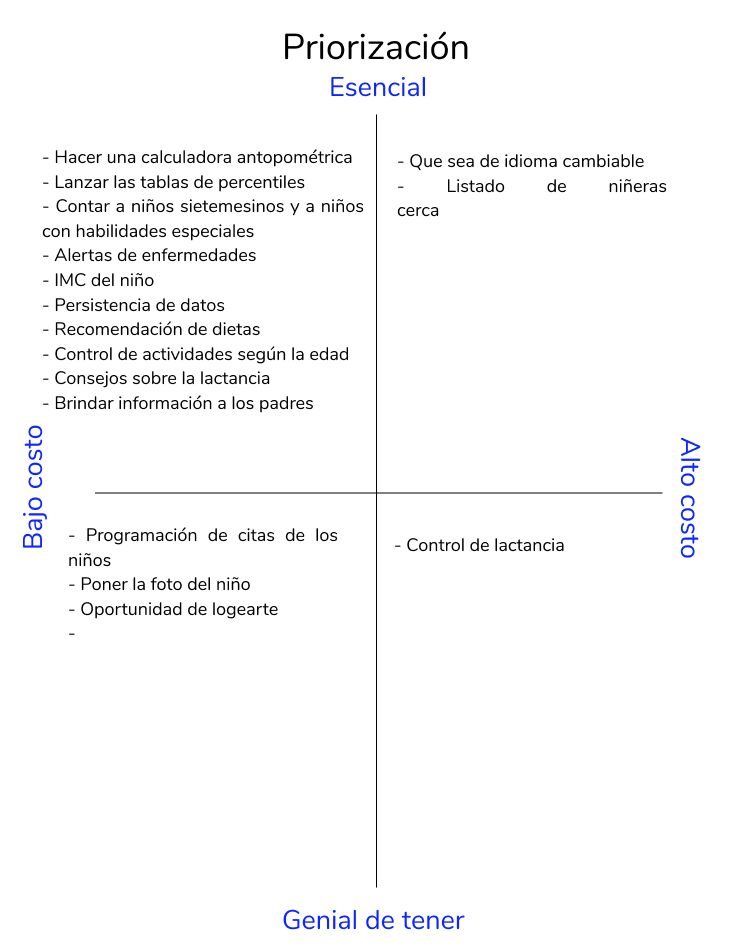

# Super Wawa

App para celular que te permite llevar el control del desarrollo nutricional de tus wawas, desde los 0 meses hasta los 3 años. Podrás encontrar una calculadora antropométrica, percentiles, dietas y una guía de desarrollo psicomotor. 

## Análisis Actual

### Descubrimiento del problema a resolver

Como todo país, el Perú también tiene defectos, los más grandes son: falta de dinero, asaltos, inestabilidad laboral, corrupción, salud, costos elevados en servicios básicos y la desnutrición en niños.

Se reliazó una investigación previa sobre esta última situación. Encontramos que: 

- El Perú tiene uno de los mejores planes para combatir la desnutrición llamado "Dando la Talla".

- Con este proyecto se disminuyó en un 5% la taza de niños desnutridos, solo en 5 años.

- Según naciones unidas el Perú tiene las condiciones para ser el primer país hambre cero.

- Los mil primeros días de vida son desicivos para una persona, esto porque en base a su nutrición se definirá talla, contextura y capacidad de retención.

## Plan de Research

### Planteamiento de Research para la solución a la desnutrición en el Perú

##### Realizado por: María Alexandra Calderón Chumbes

Aplicación móvil que acompañe y guíe a médicos especialistas en el control de enfermedades nutricionales en niños dentro de los primeros mil días de vida.

*Stakeholders: Médicos especialistas en desnutrición, hospitales, clínicas, centros enfocados en nutrición y padres de familia con hijos menores a 3 años*

*Fecha de revisión: Viernes 16 de marzo del 2018*

Se descubrió que uno de los principales problemas en el Perú es la desnutrición. Esto se puede cambiar con un correcto control nutricional y buena alimentación principalmente en los mil primeros días de vida. 

Investigación previa:

- Uno de los principales problemas del Perú es la desnutrición, en general es de el 46% y solo en niños alcanza un 13.1% en niños menores a 5 años.

- Ya hay en el país un gran proyecto desarrollándose (Dando la Talla), con el cual se está disminuyendo la desnutrición en un 5%.

- La Desnutrición en niños causa: fatiga, poca retención de información, baja talla, bajo peso o sobrepeso, malhumor, etc. Que a lo largo del tiempo se convierten en obstáculos para su vida universitaria y profesional, dando como resultado un sueldo menor a una persona que fue bien nutrida durante su niñez. 

- Software de la OMS: Este programa de pc es completo y complejo a la vez. Tiene una calculadora antropométrica, tablas percentiles, control psicomotor, etc. de funcionalidades enfocadas en médicos de hospitales y clínicas, e incluso pueden comparar a sus pacientes. 

- Aplicaciones en Play Store: Hay unas seis aplicaciones que de forma básica tienen funcionalidades que ayudan a los médicos y padres. Tres de ellas poco entendibles y las otras tres son muy efectivas.

#### Hipótesis

Crear una aplicación enfocada en médicos especialistas en nutrición con la cual puedan llevar el control de niños con enfermedades nutricionales.

#### Objetivos Comerciales

¿Cuál es el propósito de esta investigación? ¿Qué ayudará esta investigación a informar o resolver? Comprender los objetivos más amplios me ayuda a garantizar que la investigación esté diseñada para ayudar a respaldar la estrategia comercial de mi cliente. Quiero asegurarme de proporcionar datos procesables, no meramente datos interesantes.

#### Objetivos de la Investigación

Los objetivos de investigación son diferentes de los objetivos comerciales. Aquí, bosquejo las preguntas de investigación que responderá el estudio.
¿Qué es útil? ¿Qué necesita la gente? ¿Quién es el público objetivo entre los peruanos?
¿Qué se puede usar? ¿Qué diseño funciona para las personas y cómo se puede implementar?

El objetivo de la investigación es descubrir qué tan valida es la hipótesis inicial. Con esto podremos saber cuál es el target de usuarios que tendremos,qué tipo de información necesita este target y cuáles serían las mejores opciones de diseño para vender el producto.

#### Metodología de la investigación

La metodología a usar será *Design Thinking*. ¿Por qué? Es una forma de crear productos y servicios que tiendan a satisfacer en mejor manera las necesidades de los usuarios haciéndolos parte activa del proceso de creación.
También la *metodología Agile*, la cual basa su desarrollo en un ciclo iterativo , en el que las necesidades y soluciones evolucionan a través de la colaboración entre los diferentes equipos involucrados en el proyecto.

#### Perfil del participante
Utilizó esta información para construir el filtro, por lo que detallo exactamente a quién queremos reclutar y a quién seleccionar. La plantilla para esta investigación es:

- Médicos y enfermeros/as especialistas en pediatría y/o nutrición.
- Padres y madres con hijos menores a tres años.
- No hay un rango de edad.

#### Metodología de Reclutamiento

*Guerrilla*

Dirigirnos a clínicas, hospitales y postas, donde podamos encontras a médicos y enfermeros/as. Para encontrar a padres y madres, visitar parques, centros de recreación, centro de estudios, etc.

*Incentivos*

A todos los participantes se les entregará un obsequio en agradecimiento con la información y ayuda brindada.

#### Expectativas sobre entregas y tiempos

1. 1ra Semana: 

Ideación, Research y validación de hipótesis.

2. 2da semana: 

Prototipado, testing y conclusiones.

## Research

### Reunión de Kick off:

**Objetivos:**

* Descubrir qué necesitan saber los padres sobre la nutrición de sus hijos.
* Conocer el proceso de diagnóstico de enfermedades nutricionales
* Conocer en qué situación se utilizará mi producto
* Conocer sobre la lactancia y adecuada para niños menores a 3 años
* ¿Qué información brindarle a los padres para que puedan entenderlo?
* ¿Cuáles son los términos médicos que debo incluir y cuáles no?

### Guía de Entrevista a un médico

**Screen validation:**

- ¿Cuál es tu nombre?
- ¿Cuántos años tienes?
- ¿Cuál es tu profesión?
- ¿Tienes hijos?

**Sobre enfermedades de desnutrición:**
 	
- ¿Qué es lo primero que tomas en cuenta cuando revisas a un niño?
- ¿Cuáles son las enfermedades nutricionales más frecuentes?
- ¿Cuáles son las enfermedades nutricionales más frecuentes qué has tratado?
- ¿En qué rango de edad estaban estos niños?
- ¿Los padres del niño estaban informados del tema?
- ¿Qué es lo que haces para identificar a un niño con una enfermedad nutricional?
- ¿Qué datos son esenciales para un diagnóstico de enfermedad nutricional en niños?
- ¿Cuál es el proceso de diagnóstico de una enfermedad nutricional?
- ¿Cuál o cuáles son los mejores métodos para diagnosticar?
- ¿Qué dificultades tienes para diagnosticar?
- ¿Estas enfermedades tienen alguna clasificación?
- ¿Usas algún programa para diagnosticar? ¿Cuál? ¿En qué dispositivos?
- ¿Qué factores influyen a la generación de una enfermedad nutricional?
- ¿Cuál es la prevención para las enfermedades nutricionales en niños?
- ¿Sirve una dieta balanceada para niños? 
- ¿Cuál sería el horario ideal de comidas para un niño?
- ¿Qué deberían de tomar en cuenta los padres en el cuidado nutricional de un niño? ¿Por qué?

**Lactancia:**

- ¿Qué es sí la lactancia?
- ¿Por qué es esencial en la vida de un niño?
- ¿Cuánto tiempo debe de lactar un niño?
- ¿Cuál es el proceso correcto para dar de lactar? (Horarios)
- ¿El sueño del bebé también es importante para la nutrición? ¿Qué otros factores influyen?
- ¿Cuál sería el horario ideal de horas de sueño de un bebé?
- ¿Qué debe hacer una madre con un niño lactante?
- ¿Son recomendables las fórmulas infantiles?
- ¿Podría un niño desarrollarse bien si solo tomara fórmulas y no leche materna?

**Sobre terminologías:**

- ¿Qué son los percentiles? ¿Para qué los utilizas?
- ¿Qué es una calculadora antropométrica? ¿Para qué lo usas?
- ¿Qué es un IMC?
- ¿Qué es un CDC?
- ¿Qué otros métodos hay dentro del campo de las enfermedades nutricionales? ¿Cuáles usas tú?

**Sobre la app:**

- ¿Te ayudaría tener una aplicación que te diera de forma fácil los datos que acabas de mencionar?
- ¿Qué te gustaría encontrar? (Cuadros, tablas)

**Conclusión:**

- Luego de lo que acabamos de hablar, ¿hay algo que quieres averiguar acerca de eso?

### Guía de entrevista a una madre

**Screen validation:**

- ¿Cuál es el sexo de tu bebé?
- ¿Cuanto tiempo tiene tu niño o niña?

**Lactancia:**

- ¿Aún le das de lactar a tu bebé? y por qué?
- ¿Tienes horarios de lactancia?
- ¿Sabes las técnicas de lactancia?
- ¿Qué alimentación complementaria utilizas para tu hij@?
- ¿Llevas algún tipo de alimentación especial o complementaria en esta etapa de lactancia?

**Nutrición:**

- ¿Tienes alguna referencia o guía de cómo alimentar a tu hij@?
- ¿Sabes el peso y talla de tu hij@?
- ¿Constantemente revisas su peso y talla?
- ¿Cómo sabes si tu hijo está sano?
- ¿Utilizas alguna app para llevar el control nutricional de tu hij@? cuál? por qué?
- ¿Tu hij@ lleva un control nutricional? (Pediatra, nutricionista, bromatólogo, familiar)
- ¿Conoces las condiciones alimenticias requiere tu hijo para su edad? Cuáles?
- ¿Sabes qué condiciones o actividades debe cumplir tu hij@ para su edad? 
- ¿Sabes sobre las enfermedades de nutrición? Cuáles?
- ¿Alguna vez has llevado a tu hij@ a un diagnóstico de enfermedades alimenticias?

**Final:**

- ¿Cuando estabas embarazada sabías qué cuidados necesitaba un bebé? (primer bebé)
- ¿Qué es lo que descubriste necesitaba un bebé ya siendo mamá?
- ¿Te sientes en la capacidad de saber todo sobre tu hij@?

## Entrevistas

Las entrevistas se desarrollaron durante la primera semana de acuerdo con el plan de Research.

En la siguiente carpeta de Drive, puede encontrar los audios: 

[Entrevistas](https://drive.google.com/drive/folders/1WIa4aPP2Wp7s7I1DIRdWk_RuQZv6FhRe?usp=sharing)

## User persona

### User persona principal

### User persona secundario

### User persona extremo

## Feature List

## Priorización

## Prototipo en papel

**Herramientas utilizadas:**
* **Figma**
* **Marvel**
* **Design Thinking**
* **Sketch Templates**
* **Mapa de afinidad**
* **Research**

